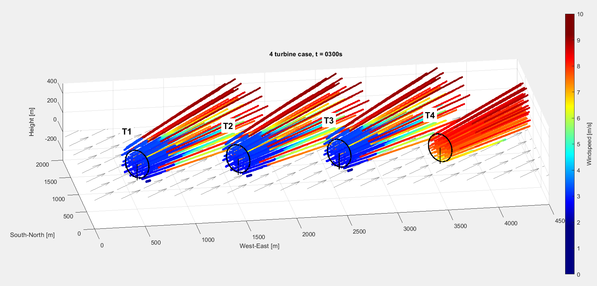
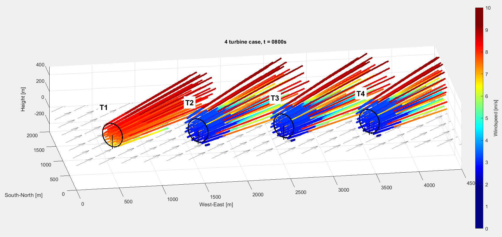
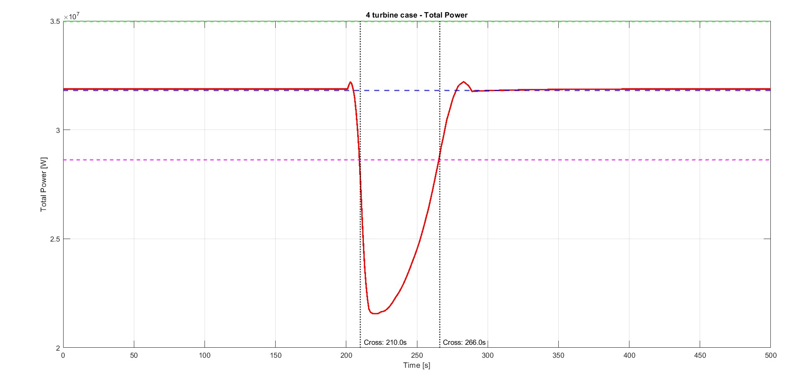

# FLORIDyn+

**FLORIDyn+** is a platform to simulate cyber-physical attacks on wind farms. It can be used to develop countermeasures and generate data for designing detection mechanisms. It is an extension of **FLORIDyn** [1], a dynamic wind farm simulation tool based on the FLORIS model [2].

---

## Paper and Citation

[Include a link or citation to your paper here.]

---
## Example
We consider a scenario with a wind farm of four turbines. Initially, wind turbine T4 is shut down to limit mechanical loads and preserve its lifetime, while the other turbines operate at 75% of their maximum potential. 

After 200 seconds in steady state, an adversary activates the emergency brake on turbine T1.

This causes a drop in total power output, falling below the allowed discrepancy threshold at t = 210 s.

In response, T4 is started up at t = 211 s, which eventually compensates for the power loss and counters the attack.
  
This is one possible countermeasure. Using this toolbox, you can study whether this is the fastest or most effective response. For example, you could also investigate increasing the output of the remaining turbines, which can be found in the paper. The toolbox allows you to analyze different reaction times, strategies for mitigating attacks, how much time you have to react before the grid demand is violated, and provides all relevant data in Excel (.xlsx) files. These files can be used for further analysis, such as developing and testing detection methods for cyber-attacks.

---

## Getting Started

#### Main

The `main.m` file allows you to configure:
- The wind farm layout
- Wind scenarios: choose between a realistic wind field modeled as an Ornstein-Uhlenbeck process, static wind fields, or changing/no-changing wind directions.
- Plotting options (note: `vis.load_effects` is not fully implemented yet and when making a rolling correlation plot make sure that movcorr(x, y, k, varargin): Compute windowed correlation coefficient [3] is installed in matlab).

These parameters are mostly self-explanatory and enable high customization of your simulation case.

#### Attack_Scenarios

The `Attack_Scenarios.m` folder contains predefined cyber-attack scenarios. You can also add new custom scenarios here.

#### Attack_main

Running `Attack_main.m` starts the simulation. In this script, you can:
- Choose among the predefined wind field scenarios (as configured in `main.m`).
- Set the grid demand and safety margin.
- Define how long to run the simulation before it is in steady state  (to allow wake effects to stabilize).
- Select one or multiple attack scenarios for each wind turbine to begin at different time steps.

#### Data Saving
Simulation outputs are automatically saved in the `/data` folder. 

---

## Extending the Platform

### Simulation Loop
The simulation advances through discrete time steps in `FLORIDyn.m`, covering:
- **Wind & Turbine States**: Updates wind conditions and turbine operational states, based on controller inputs and any active **cyber-attacks** scenario.
- **Power & Control**: Adjusts turbine jaw for optimal wind allignment and calculates power output.
- **Wake Dynamics**: Models how wakes from upstream turbines affect those downstream.
- **Data**: Gathers essential data, like power and windspeed.

### Customizing the current controller
To customize the controller, add or edit states in `Finite_State_Machine.m`. Make sure to define the logic for each state and ensure it is called appropriately in the main simulation loop.

### Adding a New Attack Scenario
To add a new attack scenario:
1. Add a new state for your attack in `Finite_State_Machine.m`.
2. Initialize the attack scenario in `main.m` and `Attack_Scenarios.m`.
3. Ensure the attack is handled in the simulation loop in `FLORIDyn.m`.

### Adding New Plots
You can add new plots by gathering data in the simulation loop and call them in `main.m`.

### Setting up a new turbine
To integrate a new turbine model with the current FSM controller, you need to manually add the following files to the TurbineData folder:

- **Lookup tables based on wind speed:**  
  Required variables:  
  - `Cp_vec` (power coefficient vector)  
  - `beta_vec_ws` (pitch angle vector for wind speed in °)  
  - `omega_vec_ws` (rotor speed vector for wind speed in rad/s)  
  - `windspd_vec` (wind speed vector in m/s)

- **Cp/Ct curve based on lambda and beta:**  
  Required variables:  
  - `Cp_matrix` (power coefficient matrix)  
  - `Ct_matrix` (thrust coefficient matrix)  
  - `beta_vec` (pitch angle vector in °)  
  - `lambda_vec` (tip speed ratio vector)

- **Turbine parameters:**  
  - `A` (rotor swept area in m²)  
  - `J` (rotor inertia in kg·m²)  
  - `R` (rotor radius in m)  
  - `eta` (efficiency)  
  - `p_p` (cos(yaw) exponent for power calculation)  
  - `pitch_rate` (maximum pitch rate, in deg/s)  
  - `rated_ws` (rated wind speed in m/s)

---

## Future Improvements
- Integrate mechanical loads modeling to provide additional insights into potential lifetime reduction and catastrophic failure.
- Start simulations from steady state to avoid unnecessary computation during wake stabilization
- Move beyond the simple wind-cubed model by incorporating turbine inertia and modeling losses from braking systems and generator torque to calculate power.
- Add sensor noise, delays, and drift to better simulate detection mechanisms under real-world uncertainties.
- Add a database of turbine presets so users can select common turbines without manual data entry.
- Simplifying adding attack scenarios

---

## Contributing
We welcome contributions to FLORIDyn+, your help is greatly appreciated!
#### How to Contribute
- **Report Bugs:** Please open a GitHub Issue with a clear description and steps to reproduce.
- **Suggest Enhancements:** Open a GitHub Issue to propose your idea.
- **Code Contributions:** 
    1. **Fork & Clone**: Fork our repository and clone it to your local machine.
    2. **Create Branch**: Create a new descriptive branch.
    3. **Make Changes**: Implement your code, adhering to existing style.
    4. **Commit & Push**: Commit your changes with clear messages and push to your branch.
    5. **Open PR**: Open a Pull Request on GitHub against our main branch, explaining your changes.
---
## Citation
[1] M. Becker, B. Ritter, B. Doekemeijer, D. van der Hoek, U. Konigorski, D. Allaerts, and J.W. van Wingerden, “The revised FLORIDyn model: Implementation of heterogeneous flow and the Gaussian wake,” 1 2022

[2] National Renewable Energy Laboratory, “FLORIS,” 2025. [Online].
Available: https://nrel.github.io/floris/index.html

[3] David J. Mack (2025). movcorr(x, y, k, varargin): Compute windowed correlation coefficient (https://www.mathworks.com/matlabcentral/fileexchange/65342-movcorr-x-y-k-varargin-compute-windowed-correlation-coefficient), MATLAB Central File Exchange. Retrieved June 12, 2025.

